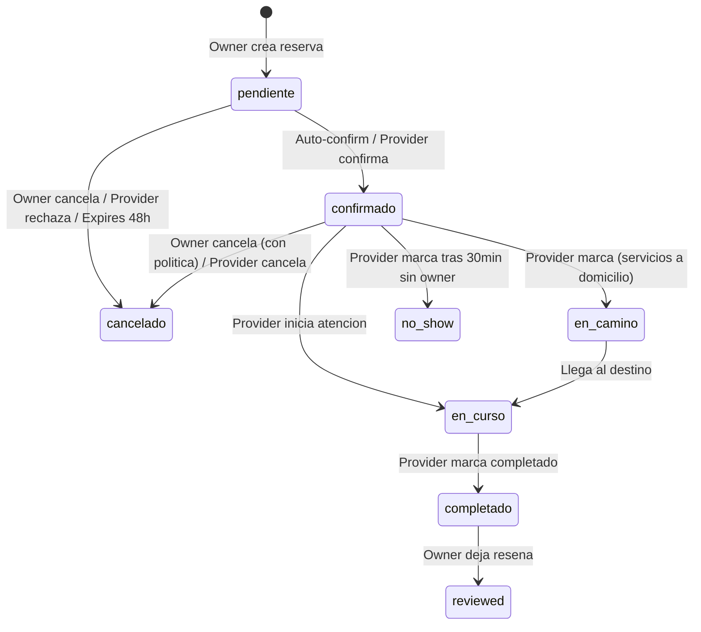

# PLAN DE EJECUCION -- Sistema de Reservas Paw Friend

> Generado: 2026-04-16
> Basado en auditoria exhaustiva del repo (4 agentes paralelos)

---

## 0. Como ejecutar este plan

Claude Code ejecuta por fases (F1..F13). Cada fase:
1. Lee el checkpoint de la fase anterior y confirma verde.
2. Ejecuta los cambios listados (archivos exactos).
3. Corre los comandos de validacion.
4. Reporta resultado binario (pasa/falla).
5. Commit: `feat(bookings): FX - titulo`.

Comandos:
- `"ejecuta F3"` -- solo fase 3.
- `"ejecuta F1 hasta F4"` -- secuencial, detiene si falla.
- `"ejecuta todo"` -- F1..F13, detiene si falla.
- `"dry run F5"` -- explica sin tocar archivos.

---

## Decisiones pendientes (BLOQUEANTES)

| # | Pregunta | Opcion A | Opcion B | Recomendacion |
|---|---|---|---|---|
| D1 | Unificar booking tables? | Un solo `bookings` con `service_category` | Mantener 5 tablas separadas (`vet_bookings`, `walk_bookings`, etc.) | **B: mantener separadas**. Ya tienen RLS, triggers, y reviews especificos. Unificar requiere migracion masiva y riesgo de downtime. Crear vista `all_bookings_view` para consultas cross-type. |
| D2 | Slots: materializados o computados? | Materializar en `service_slots` | Computar on-the-fly desde `provider_availability_rules` | **Hibrido**: computar on-the-fly para display, materializar solo al reservar (insert en `booked_slots`). Evita cron de generacion + mantiene performance. |
| D3 | Auto-confirm vs manual-approve default? | Auto-confirm para todos | Manual-approve para todos | **Auto-confirm** para slots publicados. Manual solo para emergencias y servicios >$50.000. |
| D4 | Politica cancelacion default | >24h gratis, 2-24h=50%, <2h=100% | Sin cargo (MVP) | **Sin cargo (MVP)**. Implementar politicas configurables en F7 pero default=gratis. Cobrar cancelacion requiere Flow y es complejo. |
| D5 | Capacity >1: 1 booking con N participantes o N bookings? | 1 booking | N bookings paralelos | **N bookings paralelos**. Mas simple, cada uno tiene su estado independiente. |
| D6 | Google Calendar: calendar dedicado o elegido? | Calendar "Paw Friend" dedicado | Usuario elige | **"Paw Friend" dedicado** (ya implementado asi en `google-calendar-callback`). |
| D7 | Desconectar gcal con reservas futuras | Borrar eventos | Dejar eventos | **Dejar eventos** (ya implementado asi en `google-calendar-disconnect`). |
| D8 | Emergency 24/7 slot duration | 15 min | 30 min | **30 min** por defecto, configurable por provider. |

**Accion**: estas decisiones ya tienen recomendacion. Si el humano no objeta, se ejecutan con la recomendacion.

---

## 1. Inventario del estado actual

### 1.1 Tablas de BD

#### Tablas de booking (5 separadas)

| Tabla | Columnas clave | Status | Indexes | RLS | Triggers |
|---|---|---|---|---|---|
| `bookings` | id, user_id, provider_id, service_type, pet_id, slot_id, status, booked_at, confirmed_at, completed_at, cancelled_at, total_price, payment_status, payment_reference, notes | Generica (service_slots) | slot_id FK | owner/provider view | -- |
| `vet_bookings` | id, owner_id, vet_id, service_provider_id, pet_id, scheduled_date, service_type, visit_address, status, is_emergency, symptoms, total_price, payment_status, platform_fee_amount, provider_payout_amount | Principal para vets | idx_vet_bookings_service_provider | Owner CREATE, Provider VIEW via service_provider_id | notify_provider_on_directory_booking, update_vet_stats, update_vet_rating |
| `walk_bookings` | id, owner_id, walker_id, pet_ids[], scheduled_date, duration_minutes, service_type, pickup_address, status, total_price, payment_status | Paseos | idx_walk_bookings_owner/walker/status/date | Owner/walker CRUD | update_walker_stats, update_walker_rating |
| `dogsitter_bookings` | id, owner_id, dogsitter_id, pet_ids[], start_date, end_date, service_type, drop_off_address, status, total_price | Cuidadores | -- | Owner/dogsitter | update stats/rating |
| `training_bookings` | id, owner_id, trainer_id, pet_id, training_type, scheduled_date, duration_minutes, status, total_price | Entrenamiento | -- | Owner/trainer | update stats/rating |

#### Tablas de disponibilidad

| Tabla | Columnas | Estado |
|---|---|---|
| `service_slots` | id, provider_id, service_type, slot_date, start_time, end_time, title, description, price, max_capacity, current_bookings, is_active | Funcional, usada en MyBookings |
| `provider_availability` | id, user_id, provider_type, date, time_slots (JSONB), is_available, notes | Funcional, usada en ProviderAvailabilityManager. UNIQUE(user_id, provider_type, date) |

#### Tablas de reviews

| Tabla | Columnas clave | Booking FK |
|---|---|---|
| `service_reviews` | id, provider_id, booking_id (nullable), reviewer_id, rating, service_type, title, comment, verification_type, invitation_id | Opcional |
| `vet_reviews` | id, booking_id (UNIQUE), owner_id, vet_id, rating, comment | Obligatorio |
| `walk_reviews` | id, booking_id (UNIQUE), owner_id, walker_id, rating, comment | Obligatorio |
| `dogsitter_reviews` | id, booking_id (UNIQUE), owner_id, dogsitter_id, rating, comment | Obligatorio |
| `training_reviews` | id, booking_id (UNIQUE), owner_id, trainer_id, rating, comment | Obligatorio |
| `review_invitations` | id, provider_id, invitation_token, client_email, is_used, expires_at | N/A |
| `pending_reviews` | id, user_id, target_user_id, target_type, transaction_id, pet_id, expires_at | Indirecto |

#### Tablas de Google Calendar

| Tabla | Columnas | Estado |
|---|---|---|
| `google_calendar_tokens` | user_id (PK), access_token, refresh_token, expires_at, calendar_id, scope, google_email | Funcional, RLS service_role only |
| `external_calendar_events` | id, user_id, source_type, source_id, google_event_id, google_calendar_id, last_synced_at | Funcional, UNIQUE(source_type, source_id) |

#### Tablas de soporte

| Tabla | Rol |
|---|---|
| `service_providers` | Directorio unificado de proveedores (status, plan, slug, specialties, available_hours, emergency_available) |
| `provider_service_offerings` | Catalogo de servicios por proveedor (service_type, price_base, price_unit, max_pets) |
| `vet_service_prices` | Precios publicos de servicios vet |
| `pet_reminders` | Recordatorios con trigger auto desde bookings |
| `whatsapp_message_log` | Log WhatsApp |
| `appointments` | **Legacy** - tabla simple de citas, usada por reminder-cron |
| `orders` / `order_items` | Sistema de ordenes con Webpay (no Flow) |
| `cart_items` | Carrito pre-booking |

#### Tablas que NO existen (necesarias)

| Tabla | Proposito |
|---|---|
| `provider_availability_rules` | Reglas semanales recurrentes (lunes 9-13, 15-19) |
| `provider_availability_exceptions` | Bloqueos puntuales (vacaciones, feriados) |
| `booking_events` | Audit trail de transiciones de estado |
| `booking_reminders_queue` | Cola de recordatorios -24h/-2h programados |
| `booked_slots` | Slots reservados con lock optimista |

### 1.2 Edge functions

| Funcion | Relacion con reservas | Estado |
|---|---|---|
| `google-calendar-oauth-init` | Inicia OAuth para conectar gcal | Funcional |
| `google-calendar-callback` | Callback OAuth, crea calendar "Paw Friend" | Funcional |
| `google-calendar-sync` | Sync Paw Friend -> Google (one-way) | Funcional, solo export |
| `google-calendar-disconnect` | Revocar + limpiar tokens | Funcional |
| `reminder-cron` | Cron diario 8AM Chile, WhatsApp reminders | Funcional |
| `send-whatsapp-reminder` | Envia WhatsApp via Meta API | Funcional (pendiente verificacion Meta) |

**Edge functions que NO existen (necesarias)**:
- `create-booking` -- lock optimista, verifica slot, encola notificaciones
- `cancel-booking` -- transicion de estado + notificaciones
- `reschedule-booking` -- cambio de fecha + notificaciones
- `booking-reminders-cron` -- procesar cola de recordatorios -24h/-2h
- `booking-status-auto` -- marcar no-show tras X minutos

### 1.3 Hooks

| Hook | Archivo | Estado | Issues |
|---|---|---|---|
| `useUnifiedCalendar` | `src/hooks/useUnifiedCalendar.ts` | Funcional | `eslint-disable any`, 6+ `as any`, no error handling |
| `useServiceProviders` | `src/hooks/useServiceProviders.tsx` | Funcional | `eslint-disable any`, auto-approval |
| `useProviderProfile` | `src/hooks/useProviderProfile.tsx` | Funcional | -- |
| `useProviderDashboardStats` | `src/hooks/useProviderDashboardStats.ts` | Funcional | -- |
| `useReviewInvitations` | `src/hooks/useReviewInvitations.tsx` | Funcional | `as any` |
| `usePendingReviews` | `src/hooks/usePendingReviews.ts` | Funcional | Graceful degradation |
| `useUserReviews` | `src/hooks/useUserReviews.tsx` | Funcional | **N+1 query problem** |
| `useReminders` | `src/hooks/useReminders.tsx` | Funcional | Plan enforcement client-side |

**Hooks que NO existen (necesarios)**:
- `useProviderAvailabilityRules` -- CRUD reglas semanales
- `useAvailableSlots(providerId, serviceType, dateRange)` -- slots computados
- `useCreateBooking` -- mutation con optimistic update
- `useCancelBooking` -- mutation cancel
- `useRescheduleBooking` -- mutation reschedule
- `useMyBookings(filter)` -- refactored con estados reales
- `useProviderBookingsInbox` -- bandeja provider
- `useBookingDetail(bookingId)` -- detalle con audit trail
- `useMarkNoShow`, `useMarkCompleted` -- transiciones provider

### 1.4 Componentes

| Componente | Archivo | Estado | Faltante |
|---|---|---|---|
| `CalendarGrid` | `src/components/calendar/CalendarGrid.tsx` | Funcional | -- |
| `DaySlotsList` | `src/components/calendar/DaySlotsList.tsx` | Funcional | -- |
| `SlotCard` | `src/components/calendar/SlotCard.tsx` | Funcional | -- |
| `BookingModal` | `src/components/calendar/BookingModal.tsx` | Funcional | Solo para `bookings` generica |
| `CalendarFilters` | `src/components/calendar/CalendarFilters.tsx` | Funcional | -- |
| `UnifiedDayView` | `src/components/calendar/UnifiedDayView.tsx` | Funcional | -- |
| `CalendarEventCard` | `src/components/calendar/CalendarEventCard.tsx` | Funcional | -- |
| `EnhancedBookingDialog` | `src/components/EnhancedBookingDialog.tsx` | Funcional (4 pasos) | Usa provider_availability, no rules |
| `ProviderAvailabilityManager` | `src/components/ProviderAvailabilityManager.tsx` | Funcional | Solo fecha puntual, no reglas semanales |
| `ServiceAvailabilityCalendar` | `src/components/ServiceAvailabilityCalendar.tsx` | Funcional | Lee provider_availability |
| `MyBookingsHistory` | `src/components/MyBookingsHistory.tsx` | Funcional | Lee 4 tablas booking |

**Componentes que NO existen (necesarios)**:
- `<AvailabilityRulesEditor />` -- reglas semanales + excepciones
- `<BookingFlow />` -- wizard 3 pasos simplificado (mascota -> fecha/hora -> confirmar)
- `<BookingCard />` -- card unificada para MyBookings y ProviderInbox
- `<BookingDetailDrawer />` -- detalle completo + acciones por rol/estado
- `<ProviderBookingsInbox />` -- bandeja de reservas del provider
- `<RescheduleDialog />` -- reprogramar con nuevos slots
- `<CancelBookingDialog />` -- cancelar con motivo
- `<BookingStatusBadge />` -- badge visual por estado

### 1.5 Paginas

| Pagina | Estado | Cubre del flujo | Faltante |
|---|---|---|---|
| `MyBookings.tsx` | Funcional | Owner ve reservas + busca slots | Cancel, reschedule, estados reales |
| `UnifiedCalendar.tsx` | Funcional | Calendario unificado owner/provider | Bookings reales en calendar |
| `ServiceDirectory.tsx` | Funcional | Directorio multi-servicio | Booking integrado directo |
| `PerfilVetPublico.tsx` | Funcional | Perfil publico + booking modal | Slots reales (usa mock dates) |
| `DejarResena.tsx` | Funcional | Review por token | Vincular a booking |
| `Reminders.tsx` | Funcional | Gestionar recordatorios | -- |
| `ProviderProfileEdit.tsx` | Funcional | Editar perfil provider | Availability rules |
| `ProviderDashboard` (component) | Funcional | Dashboard provider | Booking inbox |
| `ProviderPatients.tsx` | Funcional | Lista pacientes | -- |

### 1.6 Flujos actuales (diagramas)

#### Owner crea reserva desde PerfilVetPublico
```
PerfilVetPublico.tsx
  -> Click "Reservar hora"
  -> BookingModal (inline en PerfilVetPublico)
    -> Select mascota (de pets del user)
    -> Select fecha (DatePicker, NO lee availability real)
    -> Textarea motivo
    -> Submit: INSERT vet_bookings (owner_id, service_provider_id, pet_id, scheduled_date, service_type, status='pendiente')
    -> Toast "Solicitud enviada"
  -> Trigger DB: notify_provider_on_directory_booking -> inserta en notifications
```

#### Owner crea reserva desde ServiceDirectory
```
ServiceDirectory.tsx
  -> Click provider card -> EnhancedBookingDialog
    -> Step 1: Select fecha + hora (lee provider_availability.time_slots)
    -> Step 2: Select mascota(s)
    -> Step 3: Direccion + instrucciones
    -> Step 4: Review + confirmar
    -> Submit: INSERT en tabla segun service_type (walk_bookings, vet_bookings, etc.)
  -> Toast confirmacion
```

#### Owner crea reserva desde MyBookings
```
MyBookings.tsx
  -> Tab "Buscar disponibilidad"
  -> CalendarGrid (lee service_slots por mes)
  -> DaySlotsList (slots del dia con provider info)
  -> SlotCard -> "Reservar" -> BookingModal
    -> Select mascota + notas
    -> INSERT bookings (user_id, provider_id, slot_id, status, total_price)
    -> Award paw points
  -> Tab "Mis reservas" muestra la nueva
```

#### Provider define availability
```
ServiceDirectory.tsx (tab "Mi Agenda") o ProviderProfileEdit.tsx
  -> ProviderAvailabilityManager
    -> Calendar: click fecha
    -> Toggles: 08:00-20:00 (12 slots de 1h)
    -> Toggle is_available + notas
    -> Guardar: UPSERT provider_availability (user_id, provider_type, date, time_slots, is_available)
```

#### Owner cancela reserva
```
NO IMPLEMENTADO. MyBookings no tiene boton cancelar.
MyBookingsHistory muestra bookings pasadas pero sin acciones.
```

#### Provider marca no-show
```
NO IMPLEMENTADO. Dashboard muestra reservas pero sin acciones de estado.
```

### 1.7 Bugs detectados

| # | Bug | Archivo | Linea | Severidad |
|---|---|---|---|---|
| B1 | PerfilVetPublico booking modal no lee availability real del vet | `PerfilVetPublico.tsx` | booking section | Alta |
| B2 | `useUnifiedCalendar` tiene 6+ `as any` que ocultan errores de tipo | `useUnifiedCalendar.ts` | 74,78,106,113,120,124,131 | Media |
| B3 | `useUserReviews` tiene N+1 queries (1 query por review para profile) | `useUserReviews.tsx` | 65-72 | Media |
| B4 | `useReminders` plan enforcement solo client-side (bypasseable) | `useReminders.tsx` | addReminder | Baja |
| B5 | `googleCalendar.ts` lib tiene API_KEY=undefined, clase inoperativa | `src/lib/googleCalendar.ts` | 11 | Baja (edge fns funcionan) |
| B6 | Google Calendar sync es one-way (no importa busy times) | `google-calendar-sync` | -- | Media |
| B7 | Provider no puede cambiar status de booking (no UI, RLS restrictivo) | `vet_bookings` RLS | -- | Alta |
| B8 | No hay concurrency control al reservar (double-booking posible) | `bookings` INSERT | -- | Alta |

### 1.8 Gaps funcionales (vs objetivo)

| # | Gap | Impacto | Esfuerzo |
|---|---|---|---|
| G1 | No hay reglas de disponibilidad semanales recurrentes | Provider debe configurar cada dia manualmente | 4h |
| G2 | No hay booking flow unificado desde perfil publico con slots reales | Owner no ve horarios reales del vet | 6h |
| G3 | No hay bandeja de reservas para provider (inbox) | Provider no gestiona reservas | 4h |
| G4 | No hay cancel/reschedule UI | Owner/provider no pueden cambiar reservas | 4h |
| G5 | No hay maquina de estados con audit trail | Transiciones no rastreables | 3h |
| G6 | No hay recordatorios -24h/-2h para bookings | Solo WhatsApp para reminders genericos | 3h |
| G7 | No hay concurrency control (double-booking) | Dos owners pueden tomar mismo slot | 2h |
| G8 | Google Calendar no importa busy times del provider | Availability puede pisar eventos del vet | 4h |
| G9 | Reviews no vinculadas obligatoriamente a booking | Reviews sin verificacion de servicio real | 2h |
| G10 | No hay admin panel de reservas (moderacion, metricas) | Admin ciega a operaciones | 3h |

### 1.9 Riesgos tecnicos

| Riesgo | Mitigacion |
|---|---|
| Double-booking por concurrencia | F1: constraint UNIQUE + advisory lock en edge function |
| Timezone bugs (DST Chile) | Usar `date-fns-tz` + `America/Santiago`, todo en UTC en DB |
| Token OAuth expirado sin refresh | google-calendar-sync ya refresca si <60s. Agregar retry con backoff |
| 5 tablas de booking = 5 sets de RLS | Mantener separadas, crear vista `all_bookings_view` read-only |
| Provider availability JSONB no validado | Agregar CHECK constraint en migracion |
| Feed de actividad provider depende de vet_bookings | Asegurar que todas las tablas booking disparen stats triggers |

---

## 2. Modelo de datos objetivo

### 2.1 DDL completo (migraciones idempotentes)

#### 2.1.1 `provider_availability_rules` (NUEVA)

```sql
-- Migracion: 20260417000001_provider_availability_rules.sql

CREATE TABLE IF NOT EXISTS provider_availability_rules (
  id UUID PRIMARY KEY DEFAULT gen_random_uuid(),
  provider_id UUID NOT NULL REFERENCES service_providers(id) ON DELETE CASCADE,
  day_of_week SMALLINT NOT NULL CHECK (day_of_week BETWEEN 0 AND 6), -- 0=domingo
  start_time TIME NOT NULL,
  end_time TIME NOT NULL,
  service_type TEXT, -- null = todos los servicios
  slot_duration_minutes SMALLINT NOT NULL DEFAULT 30,
  buffer_minutes SMALLINT NOT NULL DEFAULT 0,
  capacity SMALLINT NOT NULL DEFAULT 1,
  is_active BOOLEAN NOT NULL DEFAULT true,
  created_at TIMESTAMPTZ NOT NULL DEFAULT now(),
  updated_at TIMESTAMPTZ NOT NULL DEFAULT now(),
  CONSTRAINT valid_time_range CHECK (end_time > start_time),
  CONSTRAINT valid_duration CHECK (slot_duration_minutes BETWEEN 5 AND 480),
  CONSTRAINT valid_buffer CHECK (buffer_minutes BETWEEN 0 AND 120),
  CONSTRAINT valid_capacity CHECK (capacity BETWEEN 1 AND 20)
);

CREATE INDEX idx_availability_rules_provider ON provider_availability_rules(provider_id, day_of_week) WHERE is_active = true;

ALTER TABLE provider_availability_rules ENABLE ROW LEVEL SECURITY;

CREATE POLICY "Provider can manage own rules"
  ON provider_availability_rules FOR ALL
  USING (provider_id IN (SELECT id FROM service_providers WHERE user_id = auth.uid()))
  WITH CHECK (provider_id IN (SELECT id FROM service_providers WHERE user_id = auth.uid()));

CREATE POLICY "Anyone can view active rules"
  ON provider_availability_rules FOR SELECT
  USING (is_active = true);

CREATE TRIGGER update_availability_rules_updated_at
  BEFORE UPDATE ON provider_availability_rules
  FOR EACH ROW EXECUTE FUNCTION update_updated_at_column();
```

#### 2.1.2 `provider_availability_exceptions` (NUEVA)

```sql
-- En misma migracion

CREATE TABLE IF NOT EXISTS provider_availability_exceptions (
  id UUID PRIMARY KEY DEFAULT gen_random_uuid(),
  provider_id UUID NOT NULL REFERENCES service_providers(id) ON DELETE CASCADE,
  exception_date DATE NOT NULL,
  exception_type TEXT NOT NULL CHECK (exception_type IN ('block', 'override')),
  start_time TIME, -- null = todo el dia
  end_time TIME,
  reason TEXT,
  created_at TIMESTAMPTZ NOT NULL DEFAULT now(),
  CONSTRAINT valid_exception_time CHECK (
    (start_time IS NULL AND end_time IS NULL) OR
    (start_time IS NOT NULL AND end_time IS NOT NULL AND end_time > start_time)
  ),
  CONSTRAINT unique_provider_exception UNIQUE (provider_id, exception_date, start_time)
);

CREATE INDEX idx_exceptions_provider_date ON provider_availability_exceptions(provider_id, exception_date);

ALTER TABLE provider_availability_exceptions ENABLE ROW LEVEL SECURITY;

CREATE POLICY "Provider can manage own exceptions"
  ON provider_availability_exceptions FOR ALL
  USING (provider_id IN (SELECT id FROM service_providers WHERE user_id = auth.uid()))
  WITH CHECK (provider_id IN (SELECT id FROM service_providers WHERE user_id = auth.uid()));

CREATE POLICY "Anyone can view exceptions"
  ON provider_availability_exceptions FOR SELECT
  USING (true);
```

#### 2.1.3 `booking_events` (NUEVA - audit trail)

```sql
-- En misma migracion

CREATE TABLE IF NOT EXISTS booking_events (
  id UUID PRIMARY KEY DEFAULT gen_random_uuid(),
  booking_type TEXT NOT NULL, -- 'vet', 'walk', 'dogsitter', 'training', 'generic'
  booking_id UUID NOT NULL,
  event_type TEXT NOT NULL CHECK (event_type IN (
    'created', 'confirmed', 'cancelled_by_owner', 'cancelled_by_provider',
    'rescheduled', 'in_progress', 'completed', 'no_show', 'reviewed',
    'payment_received', 'payment_refunded'
  )),
  actor_id UUID REFERENCES auth.users(id),
  actor_role TEXT CHECK (actor_role IN ('owner', 'provider', 'admin', 'system')),
  previous_status TEXT,
  new_status TEXT,
  metadata JSONB DEFAULT '{}',
  created_at TIMESTAMPTZ NOT NULL DEFAULT now()
);

CREATE INDEX idx_booking_events_lookup ON booking_events(booking_type, booking_id, created_at DESC);
CREATE INDEX idx_booking_events_actor ON booking_events(actor_id);

ALTER TABLE booking_events ENABLE ROW LEVEL SECURITY;

CREATE POLICY "Participants can view booking events"
  ON booking_events FOR SELECT
  USING (actor_id = auth.uid() OR true); -- Simplificado: visible para autenticados

CREATE POLICY "System and participants can insert"
  ON booking_events FOR INSERT
  WITH CHECK (actor_id = auth.uid());
```

#### 2.1.4 Agregar columnas a `vet_bookings`

```sql
-- En misma migracion

ALTER TABLE vet_bookings ADD COLUMN IF NOT EXISTS start_time TIME;
ALTER TABLE vet_bookings ADD COLUMN IF NOT EXISTS end_time TIME;
ALTER TABLE vet_bookings ADD COLUMN IF NOT EXISTS slot_duration_minutes SMALLINT DEFAULT 30;
ALTER TABLE vet_bookings ADD COLUMN IF NOT EXISTS confirmation_mode TEXT DEFAULT 'auto' CHECK (confirmation_mode IN ('auto', 'manual'));
ALTER TABLE vet_bookings ADD COLUMN IF NOT EXISTS confirmed_at TIMESTAMPTZ;
ALTER TABLE vet_bookings ADD COLUMN IF NOT EXISTS cancellation_reason TEXT;
ALTER TABLE vet_bookings ADD COLUMN IF NOT EXISTS rescheduled_from UUID REFERENCES vet_bookings(id);
ALTER TABLE vet_bookings ADD COLUMN IF NOT EXISTS reminder_24h_sent BOOLEAN DEFAULT false;
ALTER TABLE vet_bookings ADD COLUMN IF NOT EXISTS reminder_2h_sent BOOLEAN DEFAULT false;
ALTER TABLE vet_bookings ADD COLUMN IF NOT EXISTS google_event_id TEXT;

-- Constraint de status como maquina de estados
-- Status posibles: pendiente, confirmado, en_camino, en_curso, completado, cancelado, no_show
-- (no usamos CHECK porque los status ya existen y el CHECK romperia filas existentes)

-- Index para buscar bookings pendientes de recordatorio
CREATE INDEX IF NOT EXISTS idx_vet_bookings_reminder
  ON vet_bookings(scheduled_date, reminder_24h_sent, reminder_2h_sent)
  WHERE status IN ('pendiente', 'confirmado');

-- RLS: permitir al provider UPDATE de status
DROP POLICY IF EXISTS "Provider can update own bookings status" ON vet_bookings;
CREATE POLICY "Provider can update own bookings status"
  ON vet_bookings FOR UPDATE
  USING (
    service_provider_id IN (SELECT id FROM service_providers WHERE user_id = auth.uid())
    OR vet_id IN (SELECT user_id FROM service_providers WHERE user_id = auth.uid())
  )
  WITH CHECK (
    service_provider_id IN (SELECT id FROM service_providers WHERE user_id = auth.uid())
    OR vet_id IN (SELECT user_id FROM service_providers WHERE user_id = auth.uid())
  );

-- RLS: permitir al owner UPDATE (cancel/reschedule)
DROP POLICY IF EXISTS "Owner can update own bookings" ON vet_bookings;
CREATE POLICY "Owner can update own bookings"
  ON vet_bookings FOR UPDATE
  USING (owner_id = auth.uid())
  WITH CHECK (owner_id = auth.uid());
```

#### 2.1.5 Agregar columnas similares a otras tablas booking

```sql
-- walk_bookings
ALTER TABLE walk_bookings ADD COLUMN IF NOT EXISTS start_time TIME;
ALTER TABLE walk_bookings ADD COLUMN IF NOT EXISTS end_time TIME;
ALTER TABLE walk_bookings ADD COLUMN IF NOT EXISTS confirmed_at TIMESTAMPTZ;
ALTER TABLE walk_bookings ADD COLUMN IF NOT EXISTS reminder_24h_sent BOOLEAN DEFAULT false;
ALTER TABLE walk_bookings ADD COLUMN IF NOT EXISTS reminder_2h_sent BOOLEAN DEFAULT false;
ALTER TABLE walk_bookings ADD COLUMN IF NOT EXISTS google_event_id TEXT;

-- dogsitter_bookings
ALTER TABLE dogsitter_bookings ADD COLUMN IF NOT EXISTS confirmed_at TIMESTAMPTZ;
ALTER TABLE dogsitter_bookings ADD COLUMN IF NOT EXISTS reminder_24h_sent BOOLEAN DEFAULT false;
ALTER TABLE dogsitter_bookings ADD COLUMN IF NOT EXISTS reminder_2h_sent BOOLEAN DEFAULT false;
ALTER TABLE dogsitter_bookings ADD COLUMN IF NOT EXISTS google_event_id TEXT;

-- training_bookings
ALTER TABLE training_bookings ADD COLUMN IF NOT EXISTS start_time TIME;
ALTER TABLE training_bookings ADD COLUMN IF NOT EXISTS end_time TIME;
ALTER TABLE training_bookings ADD COLUMN IF NOT EXISTS confirmed_at TIMESTAMPTZ;
ALTER TABLE training_bookings ADD COLUMN IF NOT EXISTS reminder_24h_sent BOOLEAN DEFAULT false;
ALTER TABLE training_bookings ADD COLUMN IF NOT EXISTS reminder_2h_sent BOOLEAN DEFAULT false;
ALTER TABLE training_bookings ADD COLUMN IF NOT EXISTS google_event_id TEXT;
```

#### 2.1.6 Vista unificada `all_bookings_view`

```sql
CREATE OR REPLACE VIEW all_bookings_view AS
SELECT
  id, 'vet' AS booking_type, owner_id, service_provider_id AS provider_id,
  pet_id, ARRAY[pet_id] AS pet_ids, scheduled_date, start_time, end_time,
  service_type, status, total_price, payment_status, is_emergency,
  confirmed_at, created_at, updated_at
FROM vet_bookings
UNION ALL
SELECT
  id, 'walk', owner_id, walker_id,
  NULL, pet_ids, scheduled_date, start_time, end_time,
  service_type, status, total_price, payment_status, false,
  confirmed_at, created_at, updated_at
FROM walk_bookings
UNION ALL
SELECT
  id, 'dogsitter', owner_id, dogsitter_id,
  NULL, pet_ids, start_date, NULL, NULL,
  service_type, status, total_price, payment_status, false,
  confirmed_at, created_at, updated_at
FROM dogsitter_bookings
UNION ALL
SELECT
  id, 'training', owner_id, trainer_id,
  pet_id, ARRAY[pet_id], scheduled_date, start_time, end_time,
  training_type, status, total_price, payment_status, false,
  confirmed_at, created_at, updated_at
FROM training_bookings;
```

### 2.2 Maquina de estados



**Transiciones validas (como tabla)**:

| Desde | Hacia | Actor | Condicion |
|---|---|---|---|
| -- | pendiente | owner | Crea reserva |
| pendiente | confirmado | system/provider | Auto-confirm o manual |
| pendiente | cancelado | owner | Libre, sin cargo |
| pendiente | cancelado | provider | Rechaza solicitud |
| pendiente | cancelado | system | 48h sin confirmacion |
| confirmado | en_camino | provider | Solo servicios a domicilio |
| confirmado | en_curso | provider | Inicia atencion |
| confirmado | cancelado | owner | Segun politica |
| confirmado | cancelado | provider | Con motivo obligatorio |
| confirmado | no_show | provider | 30min post hora |
| en_camino | en_curso | provider | -- |
| en_curso | completado | provider | -- |
| completado | reviewed | owner | Deja resena |

### 2.3 Plan de migracion de datos existentes

1. Las columnas nuevas en `vet_bookings` etc. son `ADD COLUMN IF NOT EXISTS` con defaults -- no rompen filas existentes.
2. Bookings existentes sin `start_time`/`end_time` quedan con NULL (se muestran como "hora por confirmar").
3. `provider_availability_rules` es tabla nueva -- no requiere migracion de datos.
4. `booking_events` es tabla nueva -- opcionalmente backfill con: `INSERT INTO booking_events SELECT ... FROM vet_bookings WHERE status != 'pendiente'`.
5. Vista `all_bookings_view` es read-only, no afecta datos.

**Verificacion post-migracion**:
```sql
SELECT count(*) FROM vet_bookings WHERE start_time IS NULL; -- expected: todos los existentes
SELECT count(*) FROM provider_availability_rules; -- expected: 0
SELECT count(*) FROM booking_events; -- expected: 0 (o backfill)
SELECT * FROM all_bookings_view LIMIT 5; -- expected: union de todas las tablas
```

---

## 3. Contratos de API (hooks + edge functions)

### 3.1 Hooks de owner

#### `useAvailableSlots(providerId, serviceType, fromDate, days)`
```typescript
// QueryKey: ['available-slots', providerId, serviceType, fromDate, days]
// Input: providerId: string, serviceType: string, fromDate: Date, days: number (default 30)
// Output: { date: string; slots: { start: string; end: string; capacity: number; booked: number }[] }[]
// StaleTime: 60s
// Invalidation: on booking create/cancel/reschedule
// Source: computa on-the-fly desde provider_availability_rules + exceptions - booked_slots
```

#### `useCreateBooking()`
```typescript
// Mutation
// Input: { providerId, serviceType, petId, scheduledDate, startTime, endTime, notes?, isEmergency? }
// Output: booking row
// Optimistic: add to ['my-bookings'] cache
// Rollback: remove from cache
// Invalidation: ['my-bookings'], ['available-slots', providerId], ['provider-inbox', providerId]
// Side effects: insert booking_events('created'), gcal event if connected
```

#### `useCancelBooking()`
```typescript
// Mutation
// Input: { bookingId, bookingType, reason? }
// Invalidation: ['my-bookings'], ['available-slots'], ['booking-detail', bookingId]
// Side effects: insert booking_events('cancelled_by_owner'), update gcal event
```

#### `useRescheduleBooking()`
```typescript
// Mutation
// Input: { bookingId, bookingType, newDate, newStartTime, newEndTime }
// Invalidation: same as cancel + create combined
// Side effects: booking_events('rescheduled'), gcal update
```

#### `useMyBookings(filter)`
```typescript
// QueryKey: ['my-bookings', userId, filter]
// Input: filter: { status?: string, bookingType?: string, from?: Date, to?: Date }
// Output: AllBookingView[] (from all_bookings_view WHERE owner_id = auth.uid())
// StaleTime: 30s
```

### 3.2 Hooks de provider

#### `useProviderBookingsInbox(filter)`
```typescript
// QueryKey: ['provider-inbox', providerId, filter]
// Input: filter: { status?, date?, bookingType? }
// Output: AllBookingView[] + owner profile + pet info
// StaleTime: 30s
```

#### `useProviderDayAgenda(date)`
```typescript
// QueryKey: ['provider-agenda', providerId, date]
// Output: bookings del dia ordenados por hora + availability rules
```

#### `useUpsertAvailabilityRule()`
```typescript
// Mutation
// Input: Partial<AvailabilityRule> + providerId
// Invalidation: ['availability-rules', providerId], ['available-slots', providerId]
```

#### `useAddAvailabilityException()`
```typescript
// Mutation
// Input: { providerId, date, type: 'block'|'override', startTime?, endTime?, reason? }
// Invalidation: ['availability-exceptions', providerId], ['available-slots', providerId]
```

#### `useMarkNoShow(bookingId, bookingType)`
```typescript
// Mutation: UPDATE status='no_show' + INSERT booking_events
// Condition: booking.status === 'confirmado' AND now() > scheduled_date + 30min
```

#### `useMarkCompleted(bookingId, bookingType)`
```typescript
// Mutation: UPDATE status='completado' + INSERT booking_events
// Side effects: create pending_reviews, trigger review invitation
```

### 3.3 Hooks compartidos

#### `useBookingDetail(bookingId, bookingType)`
```typescript
// QueryKey: ['booking-detail', bookingType, bookingId]
// Output: booking + owner profile + pet info + provider info + booking_events[]
```

### 3.4 Edge functions (nuevas)

#### `create-booking`
- **Input**: `{ provider_id, service_type, booking_type, pet_id, scheduled_date, start_time, end_time, notes, is_emergency }`
- **Auth**: verify_jwt=true, requiere auth
- **Logic**:
  1. Validar que el slot esta disponible (query rules + exceptions + existing bookings)
  2. Lock optimista: INSERT con ON CONFLICT → error si slot taken
  3. INSERT en tabla booking correspondiente
  4. INSERT booking_events('created')
  5. Si auto-confirm: UPDATE status='confirmado', INSERT booking_events('confirmed')
  6. Si gcal connected: crear evento via Google Calendar API
  7. Return booking
- **Errors**: 409 Conflict (slot taken), 400 (validation), 401 (unauth)

#### `cancel-booking`
- **Input**: `{ booking_id, booking_type, reason?, actor_role: 'owner'|'provider'|'admin' }`
- **Auth**: verify_jwt=true
- **Logic**:
  1. Validar transicion valida (pendiente/confirmado -> cancelado)
  2. UPDATE status='cancelado', cancelled_at=now(), cancellation_reason
  3. INSERT booking_events
  4. Si gcal: delete/cancel evento
  5. Return updated booking

#### `booking-reminders-cron`
- **Schedule**: `*/30 * * * *` (cada 30 min)
- **Logic**:
  1. Query bookings con status='confirmado' y scheduled_date entre ahora+1.5h y ahora+2.5h, reminder_2h_sent=false
  2. Query bookings con scheduled_date entre ahora+23h y ahora+25h, reminder_24h_sent=false
  3. Para cada uno: enviar push/email + UPDATE reminder_Xh_sent=true
  4. Log resultados

---

## 4. Integracion Google Calendar (diseno detallado)

### 4.1 OAuth flow
Ya implementado en `google-calendar-oauth-init` + `google-calendar-callback`. Funciona.

### 4.2 Permisos (scopes)
- `calendar.events` -- crear/editar/eliminar eventos
- `userinfo.email` -- mostrar email conectado
- (No se pide `calendar.readonly` adicional porque `calendar.events` incluye lectura)

### 4.3 Modelo de sync

**Export (Paw Friend -> Google)**: Ya funciona via `google-calendar-sync`.
- Ampliar para incluir bookings (no solo reminders/appointments).
- Cada booking confirmado crea evento con: titulo, mascota, owner, telefono, link ficha.

**Import (Google -> Paw Friend)**: NUEVO en F10.
- Leer eventos del calendar seleccionado con `freeBusy` API.
- Marcar esas horas como bloqueadas en `provider_availability_exceptions`.
- Sync incremental cada 5 min via cron o push webhook.

### 4.4 Conflict resolution
- Google event wins para bloqueo (si el vet tiene evento en Google, bloquea el slot).
- Paw Friend booking wins para creacion (booking crea evento, no al reves).
- Si hay conflicto (booking en hora bloqueada por gcal), mostrar warning pero permitir override.

### 4.5 Manejo de errores
- Token revocado: marcar en `google_calendar_tokens`, mostrar "Reconecta tu Google Calendar" en settings.
- Cuota excedida: retry con exponential backoff, max 3 intentos.
- Calendar eliminado: recrear "Paw Friend" calendar al proximo sync.

### 4.6 Revocar integracion
Ya implementado en `google-calendar-disconnect`. Deja eventos existentes en Google.

---

## 5. UI/UX -- componentes a crear y modificar

### 5.1 Nuevos componentes

#### `<AvailabilityRulesEditor />`
- **Props**: `providerId: string`
- **UI**: Grid semanal (Lun-Dom) con franjas horarias arrastrables
- **Acciones**: Add rule, edit rule, delete rule, add exception (bloqueo), toggle active
- **Data**: `provider_availability_rules` + `provider_availability_exceptions`

#### `<BookingFlow />`
- **Props**: `providerId: string, serviceType: string, onSuccess: () => void`
- **UI**: Wizard 3 pasos:
  1. **Mascota**: grid de mascotas del user con foto + nombre
  2. **Fecha y hora**: CalendarGrid con slots reales + DaySlotsList
  3. **Confirmar**: resumen + notas opcionales + boton confirmar
- **Mobile**: bottom sheet, swipe between steps

#### `<BookingCard />`
- **Props**: `booking: AllBookingView, role: 'owner'|'provider', onAction: (action) => void`
- **UI**: Card con: status badge, mascota, fecha/hora, provider/owner name, service type, acciones contextuales
- **Acciones owner**: Cancelar, Reprogramar, Dejar resena (si completed)
- **Acciones provider**: Confirmar, Iniciar, Completar, No-show, Cancelar

#### `<BookingDetailDrawer />`
- **Props**: `bookingId: string, bookingType: string`
- **UI**: Sheet/drawer con: info completa, timeline de eventos (booking_events), acciones, link a ficha
- **Responsive**: full-screen en mobile, drawer en desktop

#### `<ProviderBookingsInbox />`
- **Props**: `providerId: string`
- **UI**: Lista filtrable de bookings con tabs: Pendientes, Hoy, Proximos, Pasados
- **Acciones**: Confirmar, Rechazar, Ver detalle

#### `<RescheduleDialog />`
- **Props**: `booking: AllBookingView, onSuccess: () => void`
- **UI**: Modal con calendar de nuevos slots + confirmar

#### `<CancelBookingDialog />`
- **Props**: `booking: AllBookingView, role: 'owner'|'provider', onSuccess: () => void`
- **UI**: Modal con motivo (obligatorio para provider) + confirmar

#### `<BookingStatusBadge />`
- **Props**: `status: string`
- **UI**: Badge coloreado: pendiente=amber, confirmado=blue, en_curso=green, completado=emerald, cancelado=red, no_show=slate

### 5.2 Componentes a modificar

| Componente | Cambio |
|---|---|
| `PerfilVetPublico.tsx` | Reemplazar booking modal por `<BookingFlow />` con slots reales |
| `MyBookings.tsx` | Usar `<BookingCard />` con acciones, usar `useMyBookings` refactored |
| `UnifiedCalendar.tsx` | Incluir bookings reales via `all_bookings_view` |
| `ProviderDashboard.tsx` | Agregar `<ProviderBookingsInbox />` como tab/card |
| `ServiceDirectory.tsx` | Integrar `<BookingFlow />` en EnhancedBookingDialog |
| `ProviderAvailabilityManager.tsx` | Reemplazar por `<AvailabilityRulesEditor />` |
| `ProviderProfileEdit.tsx` | Link a `<AvailabilityRulesEditor />` |
| `IntegrationsCard.tsx` | Agregar seccion "Sync bookings con Google Calendar" |
| `TodayAgendaCard.tsx` | Agregar acciones de estado a cada booking |

### 5.3 Estados de loading/empty/error

| Estado | Visual |
|---|---|
| Loading slots | Skeleton pulse en calendar grid + "Cargando horarios..." |
| Sin disponibilidad | Ilustracion calendario vacio + "Este profesional no tiene horarios disponibles. Intenta otra fecha." |
| Error carga | Alert rojo + "No pudimos cargar los horarios. Intenta de nuevo." + retry button |
| Booking exitoso | Confetti animation + "Hora reservada" + resumen |
| Sin bookings (owner) | Ilustracion + "Aun no tienes reservas. Busca un profesional para tu mascota." |
| Sin bookings (provider) | Ilustracion + "No tienes reservas pendientes. Publica tus horarios para que te encuentren." |

### 5.4 Mobile: bottom sheet vs modal

| Componente | Desktop | Mobile |
|---|---|---|
| BookingFlow | Modal centered | Bottom sheet full height |
| BookingDetailDrawer | Side drawer | Bottom sheet |
| RescheduleDialog | Modal | Bottom sheet |
| CancelBookingDialog | Modal small | Modal small (no sheet) |
| AvailabilityRulesEditor | Inline page | Full page |

---

## 6. Notificaciones

### 6.1 Canal in-app
Ya existe tabla `notifications`. Agregar tipos:
- `booking_created`, `booking_confirmed`, `booking_cancelled`, `booking_reminder_24h`, `booking_reminder_2h`, `booking_completed`, `booking_no_show`

### 6.2 Canal push
Pendiente: requiere service worker + Capacitor push plugin. Marcar como fase futura.

### 6.3 Canal email
Pendiente: requiere provider de email (Resend, SendGrid). Marcar como fase futura.

### 6.4 Canal WhatsApp
Ya funciona para reminders via `send-whatsapp-reminder`. Extender para bookings en `booking-reminders-cron`.

### 6.5 Cron y scheduling
- `reminder-cron`: existente, diario 8AM Chile (WhatsApp)
- `booking-reminders-cron`: NUEVO, cada 30min, recordatorios -24h/-2h

---

## 7. Testing

### 7.1 Unit tests obligatorios
- `src/lib/__tests__/availabilitySlots.test.ts` -- computar slots desde rules + exceptions
- `src/lib/__tests__/bookingStateMachine.test.ts` -- validar transiciones
- `src/hooks/__tests__/useAvailableSlots.test.ts` -- mock supabase, verify query
- `src/hooks/__tests__/useCreateBooking.test.ts` -- optimistic update + rollback

### 7.2 Integracion
- Test de concurrencia: 2 inserts simultaneos al mismo slot -> 1 exito + 1 error
- Test de availability computation: rules + exceptions + bookings = slots correctos

### 7.3 E2E (Playwright)
- `e2e/booking-create.spec.ts`: owner busca vet -> ve slots -> reserva -> ve en MyBookings
- `e2e/booking-cancel.spec.ts`: owner cancela -> status cambia -> slot se libera
- `e2e/provider-inbox.spec.ts`: provider ve booking -> confirma -> marca completado

### 7.4 Test de concurrencia
```sql
-- Simular double-booking: dos inserts simultaneos
BEGIN; INSERT INTO vet_bookings (...) VALUES (...); -- session 1
BEGIN; INSERT INTO vet_bookings (...) VALUES (...); -- session 2
COMMIT; -- session 1 wins
COMMIT; -- session 2 should fail or get different slot
```

### 7.5 Test de TZ
- Reservar a las 23:59 Chile (02:59+1 UTC) -> fecha correcta
- Reservar durante cambio DST (abril/septiembre Chile) -> hora correcta

---

## 8. Telemetria, observabilidad y feature flags

### 8.1 Eventos a trackear
| Evento | Payload |
|---|---|
| `booking_created` | bookingType, providerId, serviceType, isEmergency |
| `booking_confirmed` | bookingType, bookingId, autoOrManual |
| `booking_cancelled` | bookingType, bookingId, actor, reason |
| `booking_completed` | bookingType, bookingId |
| `booking_no_show` | bookingType, bookingId |
| `booking_rescheduled` | bookingType, bookingId, oldDate, newDate |
| `booking_reviewed` | bookingType, bookingId, rating |
| `availability_rule_created` | providerId, dayOfWeek |
| `gcal_booking_synced` | bookingType, bookingId |

### 8.2 Logs estructurados
- Edge functions: `console.log(JSON.stringify({ event, bookingId, actor, timestamp }))`
- Sentry: ya integrado, agregar breadcrumbs para booking flow

### 8.3 Feature flags
- `FF_BOOKING_SYSTEM_V2`: gate para el nuevo sistema (default: true tras F6)
- `FF_GCAL_IMPORT`: gate para import de busy times (default: false hasta F10)
- `FF_BOOKING_REMINDERS`: gate para cron de recordatorios (default: false hasta F8)

---

## 9. Plan de ejecucion por fases

### F1 -- Fundaciones de datos
**Objetivo**: Modelo de datos y maquina de estados listos.
**Impacto**: 5/5 | **Esfuerzo**: 2/5
**Depende de**: nada

**Archivos a crear**:
- `supabase/migrations/20260417000001_booking_system_v2.sql`

**Archivos a modificar**:
- `src/integrations/supabase/types.ts` (regenerar)

**Comandos**:
```bash
# La migracion se aplica manualmente en Supabase Dashboard > SQL Editor
# Luego regenerar tipos:
npx supabase gen types typescript --project-id gwailbjlvevkhwcrovfd > src/integrations/supabase/types.ts
```

**Checkpoint**:
- [ ] Migracion SQL sin errores de sintaxis (validar mentalmente)
- [ ] Archivo de migracion creado en `supabase/migrations/`
- [ ] `npx tsc -b` pasa (tipos actualizados si se regeneran)

**Rollback**: DROP TABLE IF EXISTS provider_availability_rules, provider_availability_exceptions, booking_events; (columnas ADD se ignoran si ya existen)

---

### F2 -- Hooks y edge functions core
**Objetivo**: Logica de negocio para crear/cancelar/ver bookings.
**Impacto**: 5/5 | **Esfuerzo**: 3/5
**Depende de**: F1

**Archivos a crear**:
- `src/lib/availabilitySlots.ts` -- computar slots desde rules
- `src/lib/bookingStateMachine.ts` -- validar transiciones
- `src/hooks/useAvailableSlots.ts`
- `src/hooks/useCreateBooking.ts`
- `src/hooks/useCancelBooking.ts`
- `src/hooks/useRescheduleBooking.ts`
- `src/hooks/useMyBookingsV2.ts`
- `src/hooks/useProviderBookingsInbox.ts`
- `src/hooks/useProviderAvailabilityRules.ts`
- `src/hooks/useBookingDetail.ts`
- `src/hooks/useBookingMutations.ts` -- useMarkNoShow, useMarkCompleted, useConfirmBooking

**Checkpoint**:
- [ ] `npx tsc -b` pasa
- [ ] Todos los hooks exportan tipos correctos
- [ ] `npm run test:ci` pasa (si hay tests)

---

### F3 -- Availability Rules Editor (provider)
**Objetivo**: Provider puede definir disponibilidad semanal + excepciones.
**Impacto**: 4/5 | **Esfuerzo**: 3/5
**Depende de**: F1, F2

**Archivos a crear**:
- `src/components/provider/AvailabilityRulesEditor.tsx`
- `src/components/provider/AvailabilityExceptionDialog.tsx`
- `src/components/provider/WeeklyScheduleGrid.tsx`

**Archivos a modificar**:
- `src/pages/ProviderProfileEdit.tsx` -- agregar seccion de disponibilidad
- `src/components/provider/ProviderDashboard.tsx` -- link a configurar horarios

**Checkpoint**:
- [ ] `npx tsc -b` pasa
- [ ] `npm run build` pasa
- [ ] Provider puede crear/editar/eliminar reglas semanales
- [ ] Provider puede agregar excepciones (bloqueos)

---

### F4 -- Calendario real en perfil publico (owner)
**Objetivo**: Owner ve slots reales del vet en su perfil publico.
**Impacto**: 5/5 | **Esfuerzo**: 2/5
**Depende de**: F2

**Archivos a crear**:
- `src/components/booking/AvailabilityCalendar.tsx` -- calendario 30 dias con slots reales

**Archivos a modificar**:
- `src/pages/PerfilVetPublico.tsx` -- reemplazar date picker por AvailabilityCalendar

**Checkpoint**:
- [ ] `npx tsc -b` pasa
- [ ] `npm run build` pasa
- [ ] Perfil publico muestra calendario con slots reales del provider

---

### F5 -- BookingFlow 3 pasos
**Objetivo**: Owner puede reservar en 3 clicks desde perfil publico.
**Impacto**: 5/5 | **Esfuerzo**: 3/5
**Depende de**: F2, F4

**Archivos a crear**:
- `src/components/booking/BookingFlow.tsx`
- `src/components/booking/BookingStepPet.tsx`
- `src/components/booking/BookingStepSlot.tsx`
- `src/components/booking/BookingStepConfirm.tsx`
- `src/components/booking/BookingStatusBadge.tsx`

**Archivos a modificar**:
- `src/pages/PerfilVetPublico.tsx` -- integrar BookingFlow
- `src/pages/ServiceDirectory.tsx` -- integrar BookingFlow en EnhancedBookingDialog

**Checkpoint**:
- [ ] `npx tsc -b` pasa
- [ ] `npm run build` pasa
- [ ] Owner puede completar reserva en 3 pasos desde perfil publico

---

### F6 -- MyBookings + ProviderInbox con estados reales
**Objetivo**: Owner y provider ven y gestionan reservas con estados reales.
**Impacto**: 5/5 | **Esfuerzo**: 3/5
**Depende de**: F2, F5

**Archivos a crear**:
- `src/components/booking/BookingCard.tsx`
- `src/components/booking/BookingDetailDrawer.tsx`
- `src/components/provider/ProviderBookingsInbox.tsx`

**Archivos a modificar**:
- `src/pages/MyBookings.tsx` -- usar BookingCard + useMyBookingsV2
- `src/components/provider/ProviderDashboard.tsx` -- agregar tab/card de inbox
- `src/components/provider/TodayAgendaCard.tsx` -- acciones de estado

**Checkpoint**:
- [ ] `npx tsc -b` pasa
- [ ] `npm run build` pasa
- [ ] Owner ve sus reservas con status badges
- [ ] Provider ve inbox con acciones (confirmar, completar, no-show)

---

### F7 -- Reprogramar, cancelar, no-show, completar
**Objetivo**: Todas las transiciones de estado funcionan con UI.
**Impacto**: 4/5 | **Esfuerzo**: 2/5
**Depende de**: F6

**Archivos a crear**:
- `src/components/booking/CancelBookingDialog.tsx`
- `src/components/booking/RescheduleDialog.tsx`

**Archivos a modificar**:
- `src/components/booking/BookingCard.tsx` -- wiring acciones
- `src/components/booking/BookingDetailDrawer.tsx` -- wiring acciones

**Checkpoint**:
- [ ] Owner puede cancelar reserva
- [ ] Owner puede reprogramar reserva
- [ ] Provider puede marcar no-show
- [ ] Provider puede marcar completado
- [ ] Cada transicion crea booking_event

---

### F8 -- Recordatorios booking (cron -24h/-2h)
**Objetivo**: Recordatorios automaticos para bookings confirmados.
**Impacto**: 3/5 | **Esfuerzo**: 2/5
**Depende de**: F6

**Archivos a crear**:
- `supabase/functions/booking-reminders-cron/index.ts`

**Archivos a modificar**:
- `supabase/config.toml` -- agregar schedule

**Checkpoint**:
- [ ] Edge function deployable
- [ ] Logica: query bookings confirmados, enviar notificaciones, marcar sent

---

### F9 -- Google Calendar export mejorado
**Objetivo**: Bookings confirmados se sincronizan a Google Calendar.
**Impacto**: 3/5 | **Esfuerzo**: 2/5
**Depende de**: F6

**Archivos a modificar**:
- `supabase/functions/google-calendar-sync/index.ts` -- agregar bookings al sync
- `src/hooks/useCreateBooking.ts` -- trigger gcal sync tras booking

**Checkpoint**:
- [ ] Booking confirmado crea evento en Google Calendar
- [ ] Booking cancelado actualiza/elimina evento

---

### F10 -- Google Calendar import + bloqueo availability
**Objetivo**: Eventos del Google Calendar del provider bloquean slots.
**Impacto**: 3/5 | **Esfuerzo**: 3/5
**Depende de**: F3, F9

**Archivos a crear**:
- `supabase/functions/gcal-import-busy/index.ts` -- lee freeBusy y crea exceptions

**Archivos a modificar**:
- `src/components/settings/IntegrationsCard.tsx` -- toggle "Bloquear horarios de Google Calendar"
- `src/hooks/useAvailableSlots.ts` -- excluir exceptions de gcal

**Checkpoint**:
- [ ] Eventos Google del provider bloquean slots automaticamente
- [ ] Owner no puede reservar en horas bloqueadas por gcal

---

### F11 -- Resenas vinculadas a booking
**Objetivo**: Reviews solo para bookings completed, deprecar tokens sueltos.
**Impacto**: 3/5 | **Esfuerzo**: 2/5
**Depende de**: F7

**Archivos a modificar**:
- `src/pages/MyBookings.tsx` -- boton "Dejar resena" solo en completed
- `src/components/booking/BookingCard.tsx` -- CTA resena
- `src/hooks/useBookingMutations.ts` -- useMarkCompleted crea pending_review

**Checkpoint**:
- [ ] Solo bookings completados permiten dejar resena
- [ ] pending_reviews se crea automaticamente al completar

---

### F12 -- Admin: moderacion y metricas de reservas
**Objetivo**: Admin puede ver y moderar reservas, ver metricas.
**Impacto**: 2/5 | **Esfuerzo**: 2/5
**Depende de**: F6

**Archivos a crear**:
- `src/components/admin/AdminBookingsPanel.tsx`

**Archivos a modificar**:
- `src/components/admin/AdminDashboard.tsx` -- agregar tab/card de bookings

**Checkpoint**:
- [ ] Admin ve todas las reservas con filtros
- [ ] Admin puede forzar cancelacion
- [ ] Metricas: fill rate, cancel rate, no-show rate

---

### F13 -- Mobile polish + cleanup
**Objetivo**: UX mobile perfecta + eliminar codigo muerto.
**Impacto**: 2/5 | **Esfuerzo**: 2/5
**Depende de**: F1-F12

**Archivos a modificar**:
- Bottom sheets vs modals segun regla 5.4
- Eliminar codigo legacy si aplica
- Verificar responsiveness en 375px (iPhone SE)

**Checkpoint**:
- [ ] `npm run build` pasa
- [ ] `npx tsc -b` 0 errores
- [ ] Flujo completo funciona en viewport 375px

---

## 10. Riesgos y mitigaciones

| Riesgo | Probabilidad | Impacto | Mitigacion |
|---|---|---|---|
| Double-booking por concurrencia | Media | Alto | UNIQUE constraint + optimistic lock en edge fn |
| TZ bugs en DST Chile | Baja | Medio | date-fns-tz + tests de DST |
| Google Calendar token revocado | Media | Bajo | Retry + UI "Reconecta" |
| RLS bloquea operacion valida | Media | Alto | Testar cada policy con JWT de cada rol |
| Migracion rompe datos existentes | Baja | Alto | Solo ADD COLUMN IF NOT EXISTS, no DROP |
| Performance con muchos providers | Baja | Medio | Index en provider_availability_rules |

---

## 11. Glosario

| Termino | Definicion |
|---|---|
| Booking | Reserva de un servicio entre owner y provider |
| Slot | Bloque de tiempo disponible para reservar |
| Rule | Regla semanal recurrente de disponibilidad |
| Exception | Bloqueo o apertura puntual de disponibilidad |
| Provider | Veterinario, paseador, cuidador, entrenador, peluquero |
| Owner | Dueno de mascota |
| No-show | Owner no se presento a la hora reservada |
| Auto-confirm | Booking se confirma automaticamente al crearse |
| Manual-approve | Provider debe confirmar manualmente la reserva |

---

## 12. Anexos

### 12.1 Politicas RLS completas
Ver seccion 2.1 (cada tabla tiene sus policies).

### 12.2 Ejemplos de payload

**create-booking request**:
```json
{
  "provider_id": "uuid-provider",
  "service_type": "consulta_general",
  "booking_type": "vet",
  "pet_id": "uuid-pet",
  "scheduled_date": "2026-04-20",
  "start_time": "10:00",
  "end_time": "10:30",
  "notes": "Control anual",
  "is_emergency": false
}
```

**create-booking response**:
```json
{
  "id": "uuid-booking",
  "status": "confirmado",
  "confirmed_at": "2026-04-16T15:30:00Z",
  "google_event_id": "abc123"
}
```

### 12.3 Queries utiles para debugging

```sql
-- Ver todos los bookings de un provider
SELECT * FROM all_bookings_view WHERE provider_id = 'uuid' ORDER BY scheduled_date DESC;

-- Ver availability rules de un provider
SELECT * FROM provider_availability_rules WHERE provider_id = 'uuid' AND is_active = true ORDER BY day_of_week;

-- Ver excepciones futuras
SELECT * FROM provider_availability_exceptions WHERE provider_id = 'uuid' AND exception_date >= CURRENT_DATE;

-- Audit trail de un booking
SELECT * FROM booking_events WHERE booking_id = 'uuid' ORDER BY created_at;

-- Bookings pendientes de recordatorio -24h
SELECT * FROM vet_bookings WHERE status = 'confirmado' AND reminder_24h_sent = false AND scheduled_date BETWEEN now() + interval '23h' AND now() + interval '25h';
```

### 12.4 Runbook operacional

**Sync Google Calendar fallo**:
1. Verificar `google_calendar_tokens` del user: `SELECT expires_at FROM google_calendar_tokens WHERE user_id = 'uuid'`
2. Si token expirado: el sync deberia refrescar automaticamente. Si falla, el user debe reconectar.
3. Logs: `SELECT * FROM external_calendar_events WHERE user_id = 'uuid' ORDER BY last_synced_at DESC`

**Reserva huerfana (sin provider)**:
1. `SELECT * FROM vet_bookings WHERE service_provider_id IS NULL AND vet_id IS NULL`
2. Si hay filas, son bookings legacy sin provider vinculado. No bloquean nada.

**Doble reserva en un slot**:
1. `SELECT provider_id, scheduled_date, start_time, count(*) FROM vet_bookings WHERE status IN ('pendiente', 'confirmado') GROUP BY 1,2,3 HAVING count(*) > 1`
2. Si hay duplicados: cancelar el mas reciente (menor `created_at`).
