# Paw Friend — Diagramas de Flujo (Mermaid)

> **FUENTE DE VERDAD**: para el flujo end-to-end pegable en un solo paso, usar [FLUJO_COMPLETO.mmd](./FLUJO_COMPLETO.mmd).
> Ese archivo es UN SOLO bloque completo, listo para seleccionar todo + copiar + pegar directo en [mermaid.live](https://mermaid.live) sin editar nada.
>
> Este archivo (`FLUJOS_MERMAID.md`) es **complementario**: contiene los mismos flujos partidos por modulo para cuando se quiere revisar una seccion aislada. Si hay contradiccion, gana `FLUJO_COMPLETO.mmd`.
>
> Para pegar un bloque individual de esta pagina: copia SOLO el contenido entre las marcas de codigo, SIN incluir la linea ```mermaid ni el ``` final.

---

## 1. Autenticacion y Redireccion Post-Auth

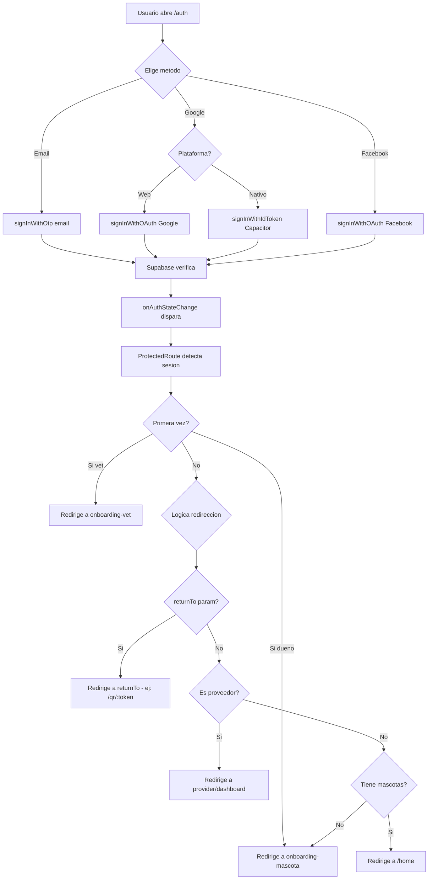

---

## 2. Mascotas — Crear mascota

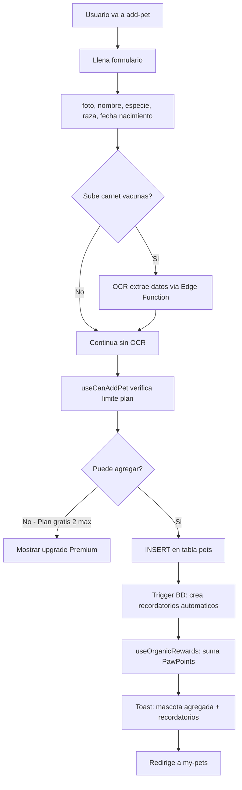

---

## 3. Ficha Clinica — Flujo completo

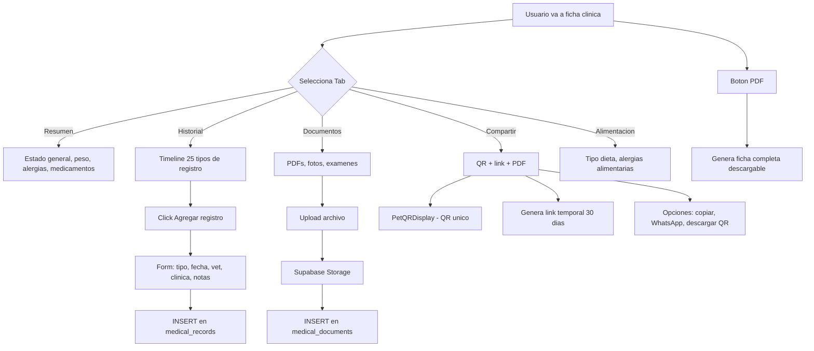

---

## 4. Recordatorios

```mermaid
flowchart TD
    subgraph AutoCreacion["Auto-creacion al agregar mascota"]
        A1["Trigger BD: create_default_reminders"] --> A2["Consulta vaccination_protocols"]
        A2 --> A3["Crea recordatorios segun especie + edad"]
        A3 --> A4["Antirrabica, Sextuple, Antiparasitario, etc."]
    end

    subgraph Visualizacion["Visualizacion"]
        B1["Home - alertas salud primero"] --> B2["Card: vencidos rojo + proximos amarillo"]
        B2 --> B2L["Link: Ver todos los recordatorios"]
        B3["Tab Recordatorios - badge en BottomTabBar"] --> B4["Lista agrupada: vencidos, hoy, proximos"]
    end

    subgraph Completar["Completar recordatorio"]
        C1["Click check"] --> C2["completeReminder.mutate"]
        C2 --> C3["UPDATE is_completed = true"]
    end

    subgraph Cron["Cron diario 9AM Chile"]
        D1["reminder-cron se ejecuta"] --> D2["Busca recordatorios proximos"]
        D2 --> D3{"Canal disponible?"}
        D3 -->|Email| D4["Envia email"]
        D3 -->|WhatsApp| D5["Pendiente verificacion Meta"]
    end
```

---

## 5. Directorio de Veterinarios

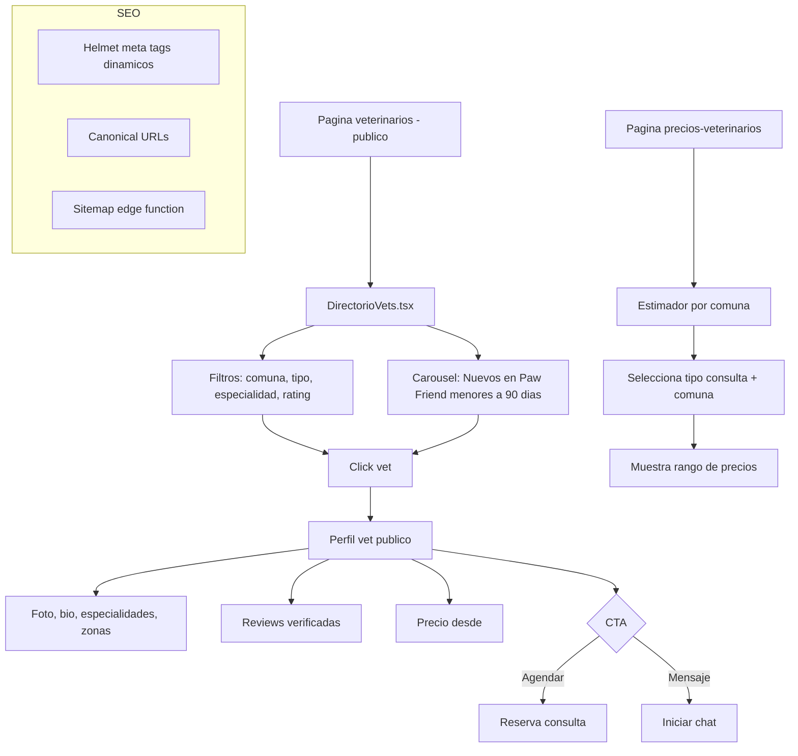

---

## 6. Dashboard Veterinario

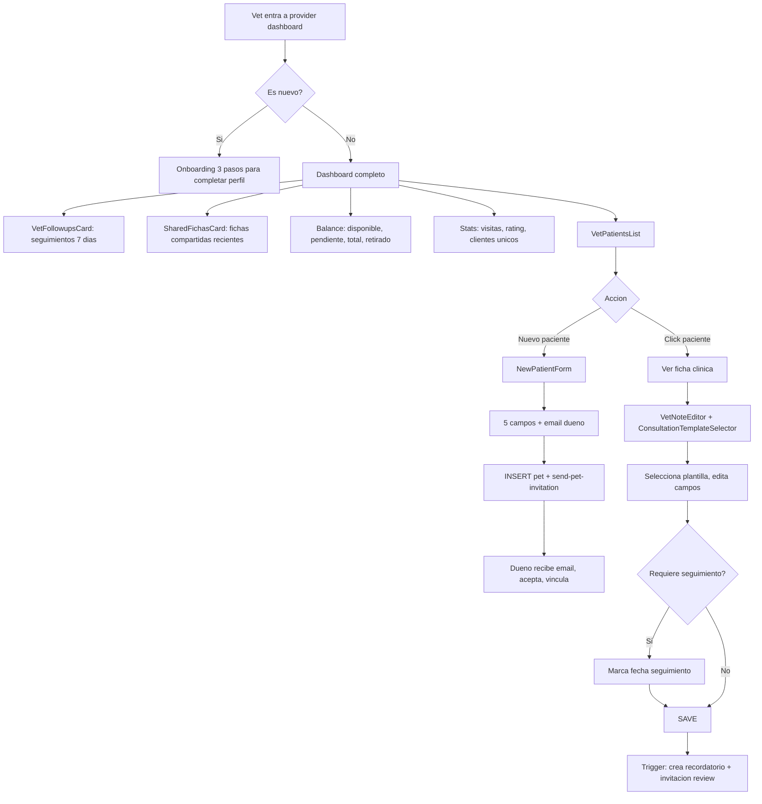

---

## 7. Chat y Mensajeria

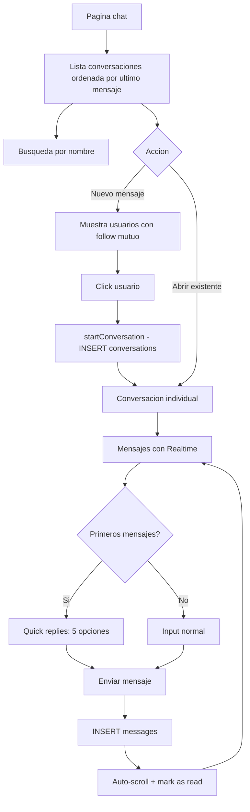

---

## 8. Social — Feed

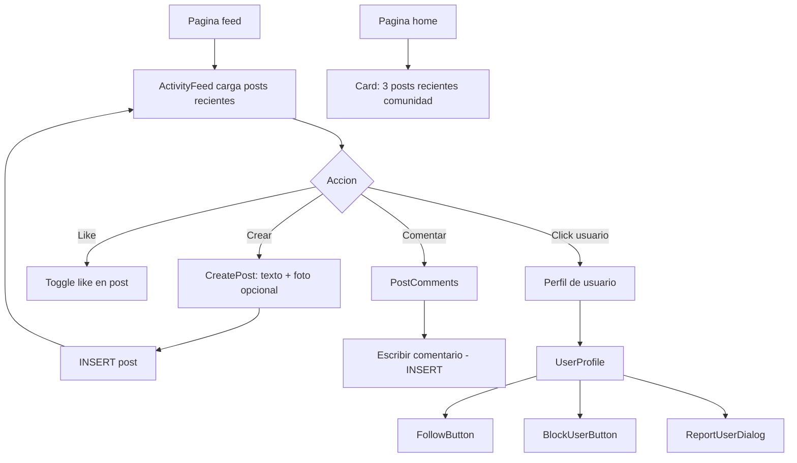

---

## 9. Asistente IA — Pet Assistant

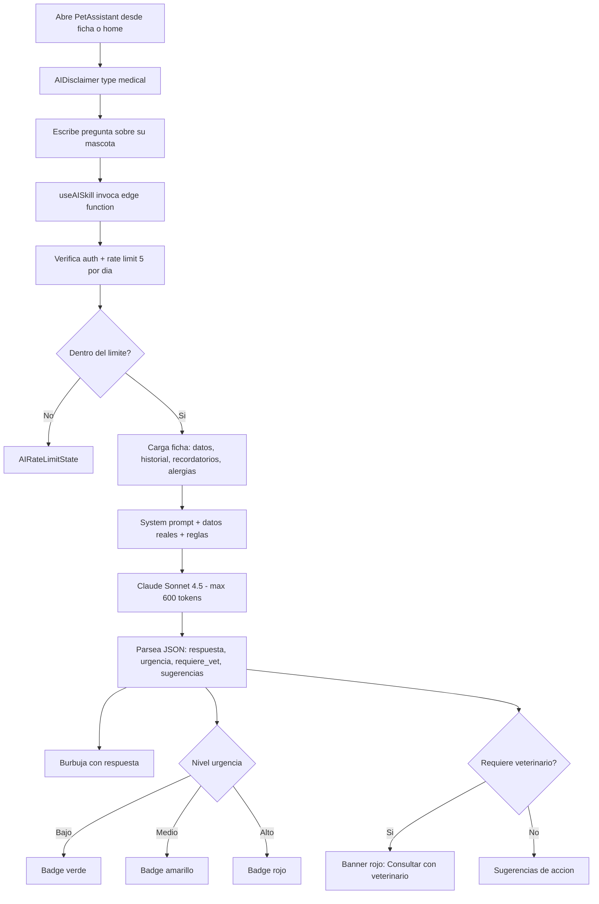

---

## 10. Pagos — Flow Premium B2C

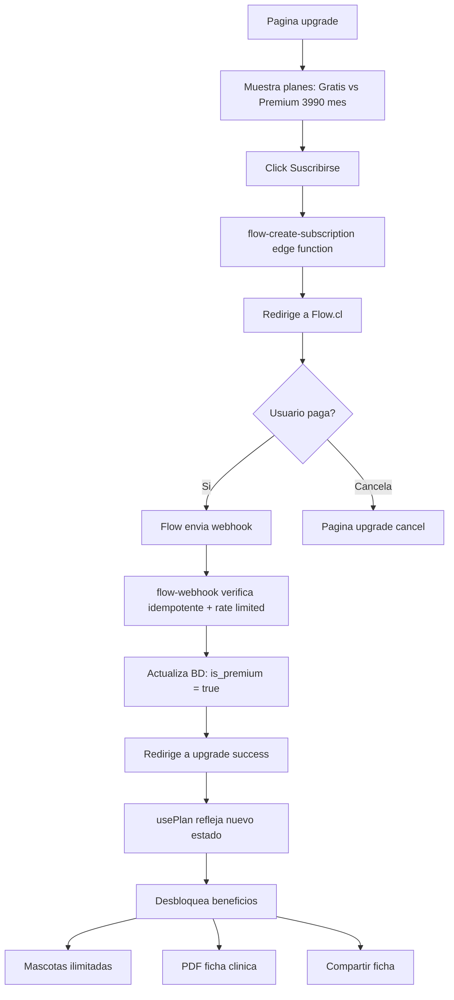

---

## 11. Reviews y Resenas

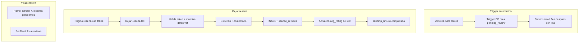

---

## 12. Sistema QR

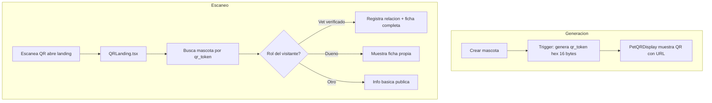

---

## 13. Google Calendar

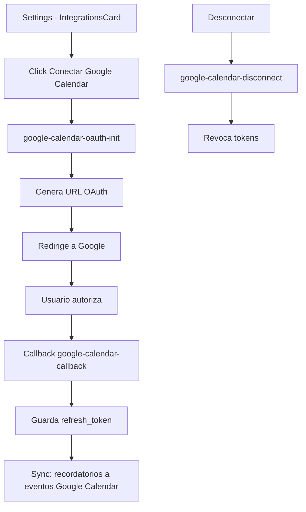

---

## 14. Onboarding — Todos los flujos

### 14a. Onboarding Dueno Minimal (/onboarding-mascota)

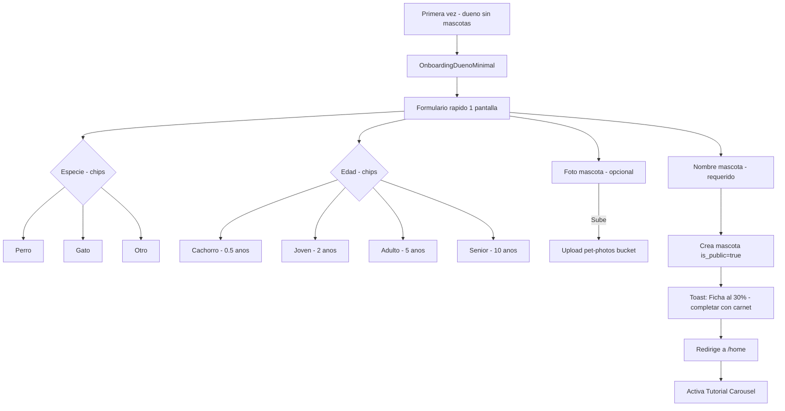

### 14b. Onboarding Vet Minimal (/onboarding-vet)

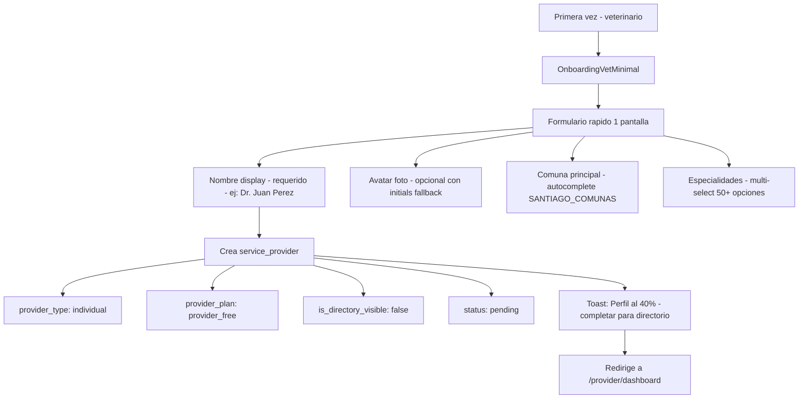

### 14c. Registro Veterinario Completo (/registro-veterinario)

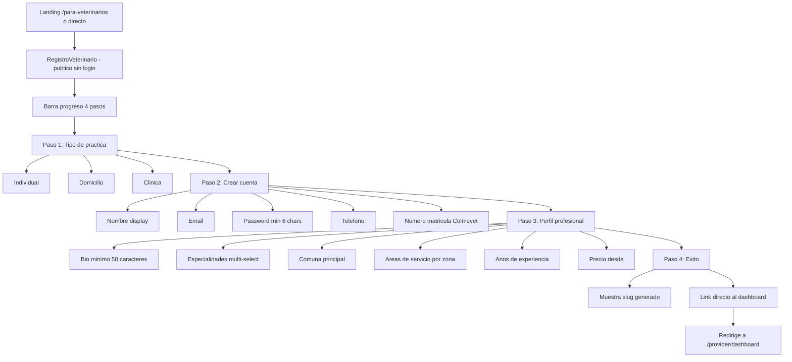

### 14d. Tutorial Carousel (OnboardingTutorial)

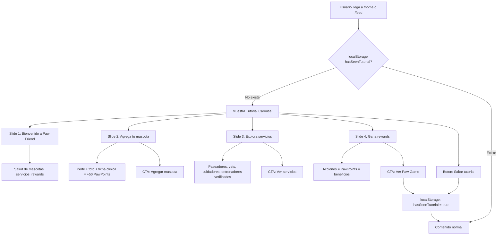

### 14e. Home Onboarding Hints (sin mascotas)

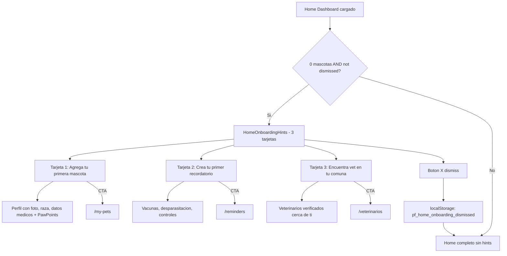

### 14f. QR Landing — Onboarding contextual (/qr/:token)

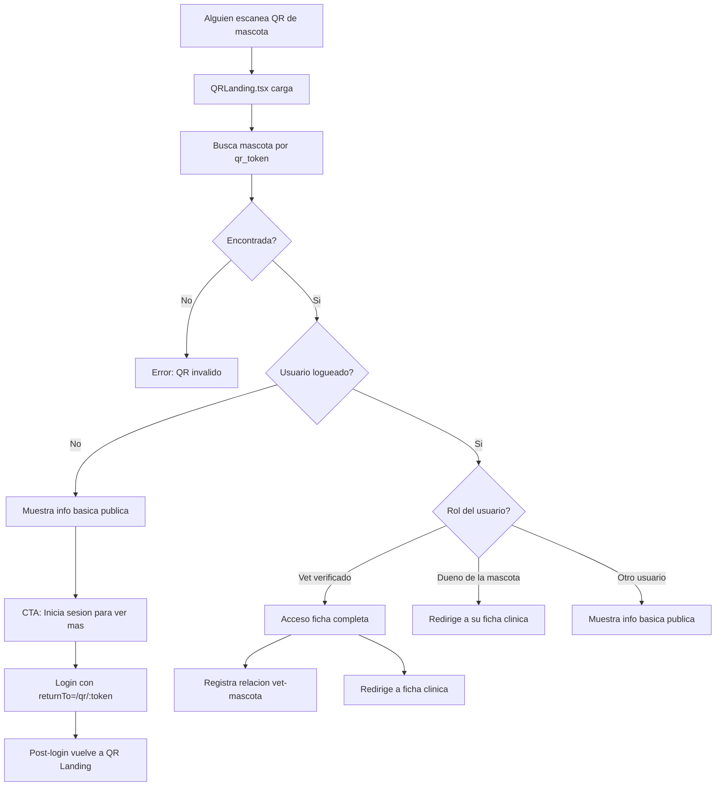

### 14g. PawGame Tutorial

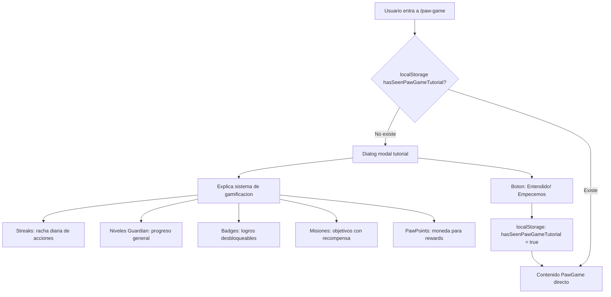

### 14h. OCR Carnet de Vacunas (onboarding de datos medicos)

```mermaid
flowchart TD
    A["AddPet - despues de crear mascota"] --> B["Seccion VaccinationCardOCR"]
    B --> C{"Sube foto carnet?"}
    C -->|No| D["Continua sin OCR"]
    C -->|Si| E["Valida archivo"]

    E --> F{"Formato OK? JPG/PNG/HEIC max 10MB"}
    F -->|No| G["Error: formato no soportado"]
    F -->|Si| H{"Rate limit? 3 scans/dia"}
    H -->|Excedido| I["Error: limite diario alcanzado"]
    H -->|OK| J["Convierte a base64"]

    J --> K["Edge Function: ocr-vaccination-card"]
    K --> L["Extrae datos estructurados"]
    L --> L1["Vacunas: nombre, fecha, lote"]
    L --> L2["Desparasitaciones"]
    L --> L3["Notas adicionales"]

    L --> M["Preview editable"]
    M --> N["Usuario revisa y confirma"]
    N --> O["INSERT medical_records por cada item"]
    O --> P["Toast: Datos importados exitosamente"]
```

---

## 15. Arquitectura General — Vista de alto nivel

```mermaid
flowchart TD
    subgraph Frontend["Frontend - React 18 + Vite 5"]
        P["Pages 35+"] --> CO["Components 60+"]
        CO --> UI["shadcn/ui 50+"]
        P --> HK["Hooks 30+"]
        HK --> SB["Supabase Client"]
    end

    subgraph Backend["Backend - Supabase"]
        SB --> AUTH["Auth"]
        SB --> DB[("PostgreSQL")]
        SB --> ST["Storage"]
        SB --> RT["Realtime"]
        SB --> EF["Edge Functions 17"]
    end

    subgraph EdgeFunctions["Edge Functions 17"]
        EF --> AI["IA: pet-assistant, breed-tips, medical-suggestions"]
        EF --> PAY["Flow.cl: create-subscription, webhook"]
        EF --> GCal["Google Calendar: oauth, sync, disconnect"]
        EF --> WA["WhatsApp: send-reminder pendiente Meta"]
        EF --> PDF["generate-medical-summary, generate-medical-zip"]
        EF --> SEO_F["generate-sitemap"]
        EF --> OTHER_EF["moderate-service-promotion, generate-shelters, reminder-cron"]
    end

    subgraph Mobile["Mobile - Capacitor 7"]
        CAP["Capacitor"] --> AND["Android"]
        CAP --> IOS["iOS"]
    end

    subgraph Deploy["Deploy"]
        VB["Vite Build"] --> DOCS["docs/"]
        DOCS --> GHP["GitHub Pages - pawfriend.cl"]
    end

    Frontend --> Mobile
    Frontend --> Deploy
```

---

## 16. Flujo completo del usuario — Journey Dueno

```mermaid
flowchart LR
    A["Auth"] --> B["Onboarding Dueno Minimal"]
    B --> C["Crea mascota rapido"]
    C --> D["Home"]
    D --> T["Tutorial Carousel 4 slides"]
    T --> MAIN["Home completo"]

    subgraph NAV["BottomTabBar 5 tabs"]
        direction TB
        T1["Inicio"]
        T2["Mascotas"]
        T3["Vets"]
        T4["Recordatorios"]
        T5["Perfil"]
    end

    MAIN --> T1
    MAIN --> T2
    MAIN --> T3
    MAIN --> T4
    MAIN --> T5

    T1 --> ALERTS["Alertas salud primero"]
    T1 --> STATUS["Status cards: cita, vacunas, ficha"]
    T1 --> QUICK["Acciones rapidas"]

    T2 --> E["Ficha clinica"]
    E --> K["PDF descargable"]
    E --> L["QR compartir + descargar"]
    E --> OCR["OCR carnet vacunas"]

    T3 --> G["Buscar vet por comuna"]
    G --> M["Reservar consulta"]
    M --> N["Dejar resena"]

    T4 --> F["Recordatorios con badge"]
    F --> O["Google Calendar sync"]

    T5 --> SET["Settings + integraciones"]

    QUICK --> P["Upgrade Premium"]
    P --> Q["Flow.cl pago"]
    Q --> R["Mascotas ilimitadas + PDF + compartir"]
```

---

## 17. Flujo completo del usuario — Journey Veterinario

```mermaid
flowchart LR
    A1["Landing /para-veterinarios"] --> B1["Registro Veterinario 4 pasos"]
    A2["Auth directo"] --> B2["Onboarding Vet Minimal"]

    B1 --> D["Provider Dashboard"]
    B2 --> D

    D --> E["Completar perfil 80% para directorio"]
    D --> F["Lista pacientes"]
    D --> G["Seguimientos 7 dias"]
    D --> H["Fichas compartidas"]
    D --> I["Balance y stats"]
    D --> EDIT["Editar perfil pro"]
    EDIT --> PREV["Ver como me ven los duenos"]

    F --> J["Nuevo paciente + invitar dueno"]
    F --> K["Nota clinica + plantilla"]
    K --> L["Trigger: review + recordatorio"]

    E --> M["Aparece en directorio publico"]
    M --> N["Recibe reservas"]
    M --> O["Recibe mensajes chat"]

    P["Vet escanea QR mascota"] --> Q["QR Landing"]
    Q --> R["Acceso ficha completa + registra relacion"]
```

---

## Instrucciones de uso

1. Ir a [mermaid.live](https://mermaid.live)
2. Borrar todo el contenido del editor izquierdo
3. Copiar SOLO las lineas entre las marcas de codigo (sin incluir la linea que dice mermaid ni los backticks)
4. Pegar en el editor
5. El diagrama se renderiza automaticamente a la derecha
6. Exportar como PNG o SVG con los botones de arriba
